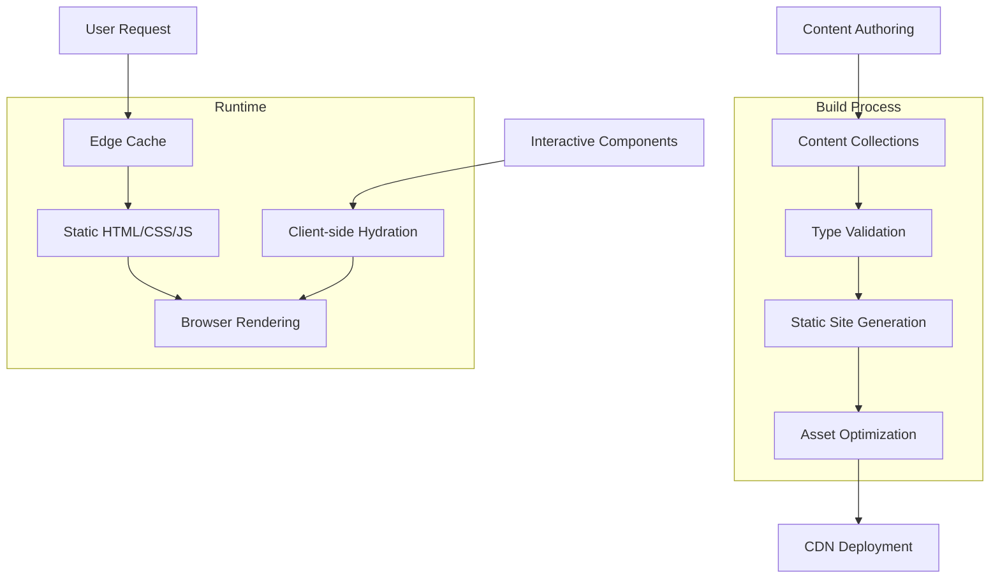
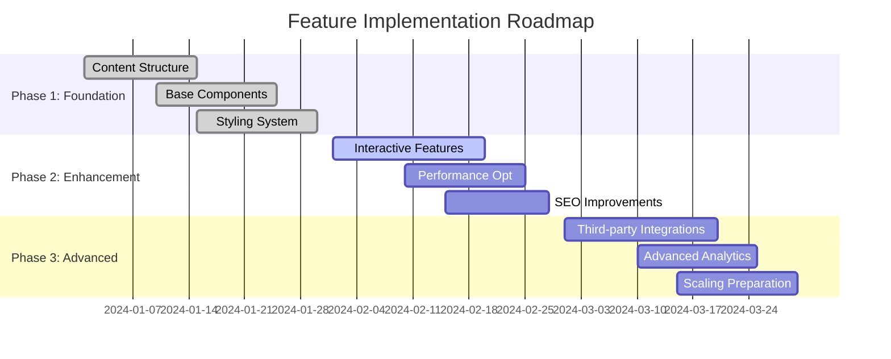
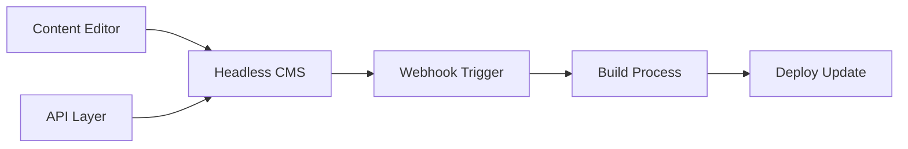
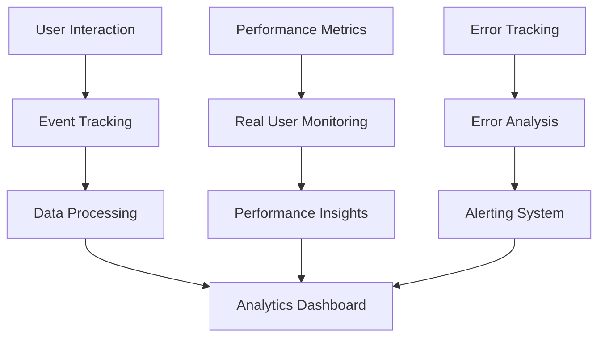

# AGENTS.architect.md - Architect Mode Planning Guide

This document provides specific guidance for AI agents working in Architect mode on the nhutduong.com project. It focuses on system design, feature planning, architectural decisions, and strategic development.

## Architect Mode Methodology

### Primary Focus

- System architecture and design decisions
- Feature planning and implementation roadmaps
- Performance optimization strategies
- Scalability considerations
- Technical debt assessment and mitigation
- Integration planning for new technologies

### Planning Workflow

1. **Understand Requirements**: Analyze business and technical requirements
2. **Assess Current State**: Evaluate existing architecture and capabilities
3. **Design Solutions**: Create architectural plans and system designs
4. **Consider Trade-offs**: Evaluate alternatives and their implications
5. **Plan Implementation**: Create detailed roadmaps and milestones
6. **Validate Decisions**: Ensure architectural decisions align with project goals

## Project Architecture Overview

### Current System Architecture



### Core Architectural Principles

#### Performance-First Design

- **Static Generation**: All content pre-built at deploy time
- **Zero JavaScript by Default**: Opt-in interactivity only when needed
- **Edge Delivery**: CDN distribution for global performance
- **Asset Optimization**: Images, CSS, and JavaScript optimized automatically

#### Developer Experience Focus

- **Type Safety**: End-to-end TypeScript integration
- **Content Validation**: Zod schemas ensure data integrity
- **Hot Reloading**: Immediate feedback during development
- **Automated Quality Checks**: ESLint, Prettier, and TypeScript validation

#### Content-Centric Architecture

- **MDX Support**: Rich content with React component integration
- **Type-Safe Collections**: Structured content with automatic validation
- **SEO Optimization**: Built-in meta tags, sitemaps, and structured data
- **Accessibility**: Semantic HTML and inclusive design patterns

## Feature Planning Framework

### New Feature Assessment

#### Evaluation Criteria

1. **Performance Impact**: How will this affect page load times and bundle size?
2. **SEO Implications**: Does this support or hinder search engine optimization?
3. **Accessibility**: Is the feature accessible to all users?
4. **Maintainability**: Can this be maintained long-term with current resources?
5. **User Experience**: Does this enhance the core user journey?
6. **Technical Debt**: Does this introduce complexity that needs future management?

#### Feature Classification Matrix

| Feature Type         | Implementation Complexity | Performance Impact | Priority Level |
| -------------------- | ------------------------- | ------------------ | -------------- |
| Content Features     | Low                       | Minimal            | High           |
| UI Enhancements      | Medium                    | Low                | Medium         |
| Interactive Features | High                      | Medium             | Medium         |
| Integrations         | High                      | Variable           | Low            |

### Implementation Roadmap Planning

#### Phase-Based Development



## Scalability Considerations

### Content Scalability

#### Current Limitations

- **File-based Storage**: Content stored in git repository
- **Build Time**: Linear scaling with content volume
- **Search**: No built-in search functionality
- **Media Management**: Manual image optimization

#### Scalability Solutions

**Content Management System (CMS) Integration**:



**Benefits**:

- Non-technical content authoring
- Workflow and approval processes
- Media asset management
- Content scheduling

**Implementation Considerations**:

- Build time impact
- API rate limits
- Content synchronization
- Backup strategies

### Performance Scalability

#### Current Performance Profile

- **First Contentful Paint**: < 1.5 seconds
- **Largest Contentful Paint**: < 2.5 seconds
- **Cumulative Layout Shift**: < 0.1
- **Bundle Size**: < 100KB JavaScript

#### Scaling Strategies

**Progressive Enhancement**:

```astro
<!-- Base functionality (static) -->
<article>
  <h1>{title}</h1>
  <div>{content}</div>
</article>

<!-- Enhanced functionality (progressive) -->
{comments && <Comments client:idle />}
{sharing && <SocialSharing client:visible />}
```

**Performance Budget Management**:

- JavaScript bundle size limits
- Image optimization thresholds
- Font loading strategies
- Caching policies

## Technology Evolution Planning

### Current Technology Assessment

#### Core Technologies

- **Astro 5.16.5**: Modern static site generator
- **React 19.2.3**: Component framework for interactivity
- **TypeScript**: Type safety and developer experience
- **Tailwind CSS 4.1.18**: Utility-first styling

#### Technology Lifecycle Management

**Evaluation Framework**:

1. **Community Support**: Active development and maintenance
2. **Performance**: Impact on site speed and user experience
3. **Security**: Vulnerability assessment and patch frequency
4. **Compatibility**: Integration with existing ecosystem
5. **Migration Cost**: Effort required to upgrade or replace

### Future Technology Integration

#### Emerging Technologies to Monitor

**Web Standards**:

- Web Components for framework-agnostic components
- CSS Container Queries for responsive design
- View Transitions for smooth navigation
- WebAssembly for compute-intensive operations

**Performance Technologies**:

- Edge-side rendering for dynamic content
- predictive prefetching for navigation
- Advanced image formats (AVIF, WebP)
- Resource hints (preload, prefetch, preconnect)

#### Integration Planning

**Phase 1: Foundation (Current)**

- Solidify current architecture
- Optimize existing performance
- Establish monitoring and analytics

**Phase 2: Enhancement (6-12 months)**

- Implement progressive web app features
- Add advanced search functionality
- Integrate headless CMS if needed

**Phase 3: Innovation (12+ months)**

- Explore edge computing opportunities
- Implement AI-powered features
- Consider micro-frontends if complexity increases

## Security Architecture

### Current Security Posture

#### Strengths

- **Static Site**: No server-side vulnerabilities
- **No Database**: Eliminates SQL injection risks
- **CDN Protection**: DDoS mitigation and edge security
- **HTTPS Enforcement**: Encrypted communication

#### Security Considerations

- **Third-party Dependencies**: Supply chain security
- **Client-side JavaScript**: XSS prevention
- **Form Handling**: Data validation and processing
- **API Integrations**: Authentication and authorization

### Security Enhancement Planning

#### Dependency Management

```json
{
  "scripts": {
    "security:audit": "pnpm audit",
    "security:fix": "pnpm audit --fix",
    "security:update": "pnpm update --latest"
  }
}
```

#### Content Security Policy (CSP)

```javascript
// Example CSP implementation
const csp = {
  'default-src': "'self'",
  'script-src': "'self' 'unsafe-inline' https://platform.twitter.com",
  'style-src': "'self' 'unsafe-inline'",
  'img-src': "'self' data: https:",
  'font-src': "'self'",
  'connect-src': "'self' https://api.github.com",
};
```

## Monitoring and Analytics Architecture

### Current Monitoring Setup

#### Performance Monitoring

- **Core Web Vitals**: Automatic tracking
- **Bundle Analysis**: Build-time size tracking
- **Error Tracking**: Browser console errors

#### Analytics Integration

- **Page Views**: Basic traffic measurement
- **User Engagement**: Time on page and bounce rates
- **Content Performance**: Popular posts and topics

### Enhanced Monitoring Planning

#### Advanced Analytics Implementation



#### Monitoring Stack

- **Real User Monitoring (RUM)**: Actual user experience data
- **Synthetic Monitoring**: Automated performance testing
- **Error Tracking**: JavaScript and build error collection
- **Security Monitoring**: Vulnerability scanning and alerts

## Development Workflow Architecture

### Current Development Process

#### Workflow Stages

1. **Development**: Local development with hot reload
2. **Quality Assurance**: Automated linting and formatting
3. **Testing**: Manual testing in development environment
4. **Build**: Production build with optimization
5. **Deployment**: Automated deployment to CDN

#### Quality Gates

```bash
# Pre-commit hooks
pnpm check  # Runs all quality checks

# Pre-deployment validation
pnpm build  # Ensures build succeeds
pnpm preview  # Validates production build
```

### Enhanced Workflow Planning

#### Continuous Integration/Continuous Deployment (CI/CD)

```yaml
# Example GitHub Actions workflow
name: Build and Deploy
on:
  push:
    branches: [main]
jobs:
  build:
    runs-on: ubuntu-latest
    steps:
      - uses: actions/checkout@v3
      - name: Setup Node.js
        uses: actions/setup-node@v3
        with:
          node-version: '18'
      - name: Install dependencies
        run: pnpm install
      - name: Run quality checks
        run: pnpm check
      - name: Build site
        run: pnpm build
      - name: Deploy to Cloudflare Pages
        run: wrangler pages publish dist
```

#### Testing Strategy

- **Unit Tests**: Utility function validation
- **Component Tests**: UI component behavior
- **Integration Tests**: End-to-end user flows
- **Performance Tests**: Core Web Vitals monitoring

## Decision Framework

### Architectural Decision Records (ADRs)

#### Template Structure

```markdown
# ADR-001: Adopt Static Site Generation

## Status

Accepted

## Context

Need for high-performance, secure portfolio site with minimal maintenance overhead.

## Decision

Use Astro for static site generation with React for interactive components.

## Consequences

- Positive: Excellent performance, security, and SEO
- Negative: Limited dynamic functionality, build time scaling
- Neutral: Requires content-driven mindset
```

### Evaluation Matrix for New Technologies

| Criteria             | Weight | Score | Weighted Score |
| -------------------- | ------ | ----- | -------------- |
| Performance          | 30%    |       |                |
| Developer Experience | 25%    |       |                |
| Community Support    | 20%    |       |                |
| Learning Curve       | 15%    |       |                |
| Long-term Viability  | 10%    |       |                |

## Risk Management

### Technical Risk Assessment

#### High-Risk Areas

1. **Dependency Updates**: Breaking changes in core dependencies
2. **Platform Changes**: Cloudflare Pages pricing or feature changes
3. **Content Scaling**: Build time increases with content growth
4. **Browser Compatibility**: New browser feature adoption

#### Mitigation Strategies

**Dependency Management**:

- Regular security audits and updates
- Semantic versioning adherence
- Automated dependency scanning
- Rollback procedures for problematic updates

**Platform Diversification**:

- Multi-platform deployment capability
- Vendor-agnostic configuration
- Export capabilities for migration
- Performance benchmarking across platforms

## Long-term Vision

### 5-Year Technology Roadmap

#### Year 1-2: Optimization and Enhancement

- Performance optimization and monitoring
- Enhanced content management capabilities
- Advanced analytics implementation
- Security hardening and compliance

#### Year 3-4: Innovation and Expansion

- AI-powered content recommendations
- Advanced personalization features
- Multi-language support
- Community engagement features

#### Year 5: Transformation

- Headless architecture adoption
- Micro-frontend implementation if needed
- Advanced personalization engine
- Real-time collaboration features

### Success Metrics

#### Technical Metrics

- **Performance**: Core Web Vitals maintenance
- **Reliability**: 99.9% uptime target
- **Security**: Zero critical vulnerabilities
- **Maintainability**: Technical debt reduction

#### Business Metrics

- **User Engagement**: Time on site and return visitors
- **Content Performance**: Blog post reach and impact
- **Conversion**: Contact form submissions and inquiries
- **Brand Growth**: Search engine ranking and social mentions

This architectural guide should help you make informed decisions about the nhutduong.com project's future development. Always balance innovation with stability, and ensure architectural decisions align with the project's core goals of performance, maintainability, and user experience.
